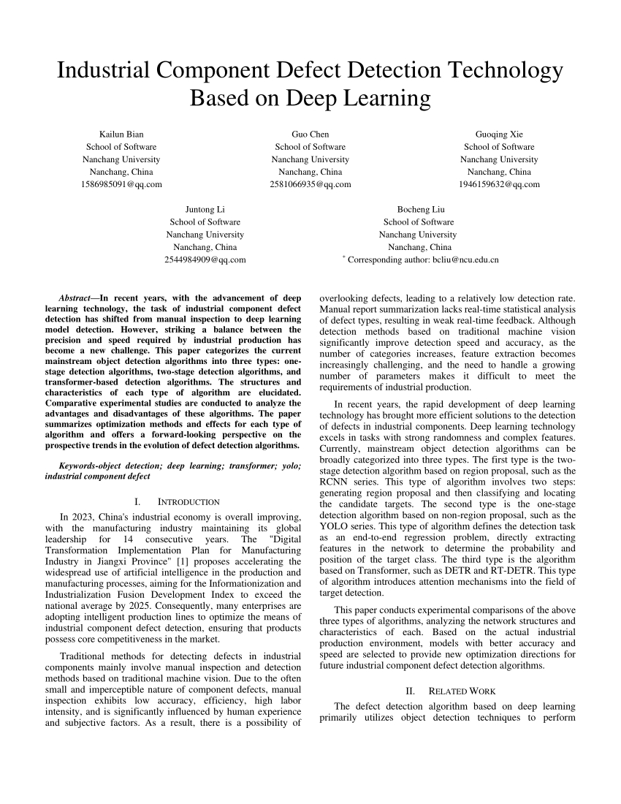
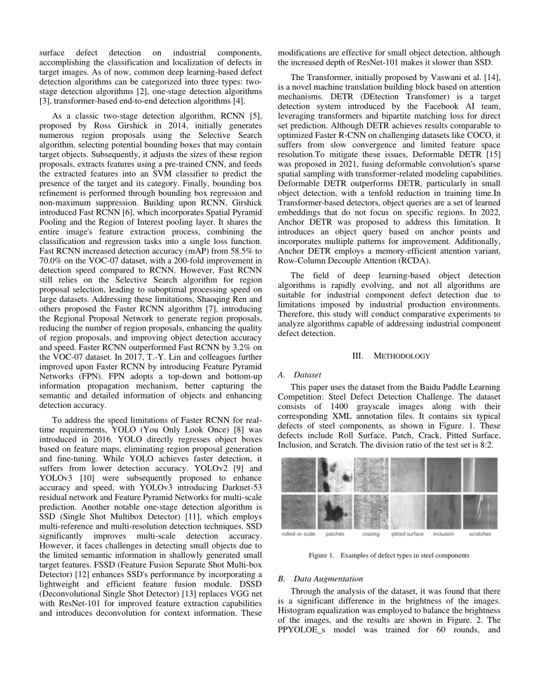
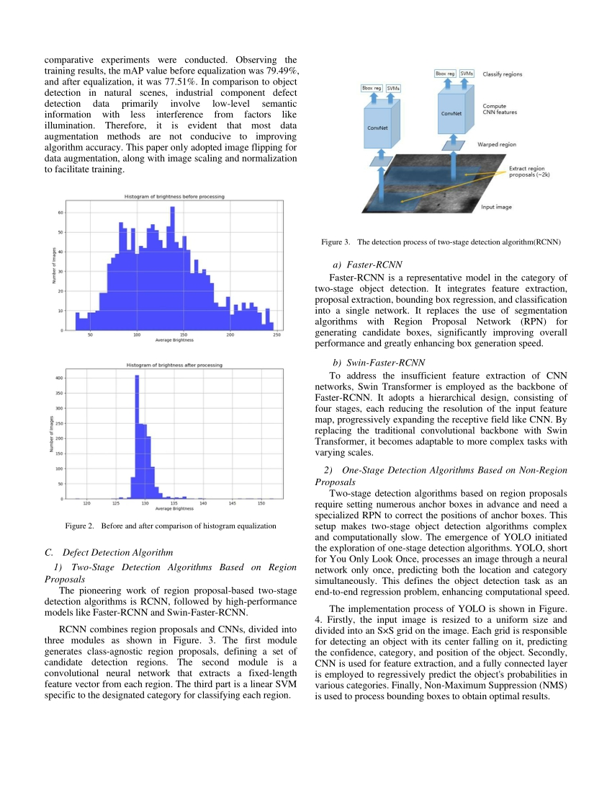
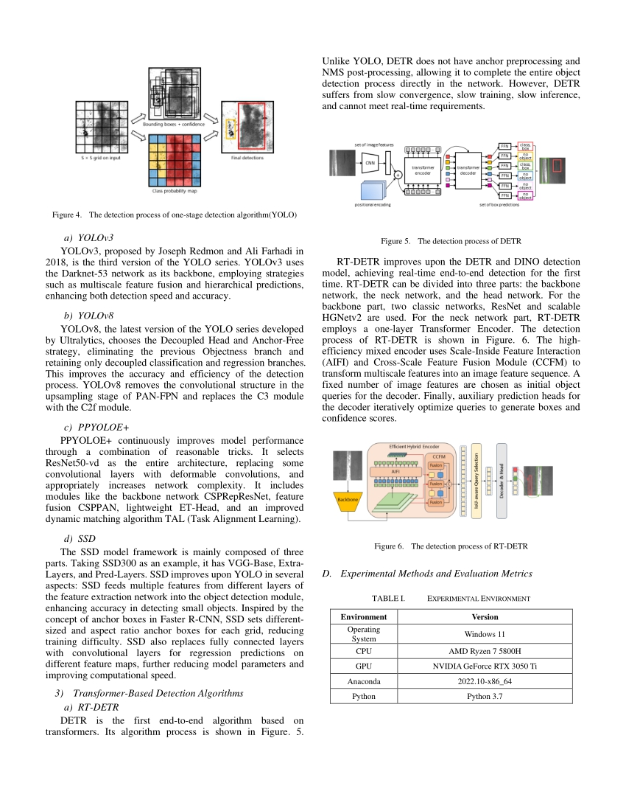
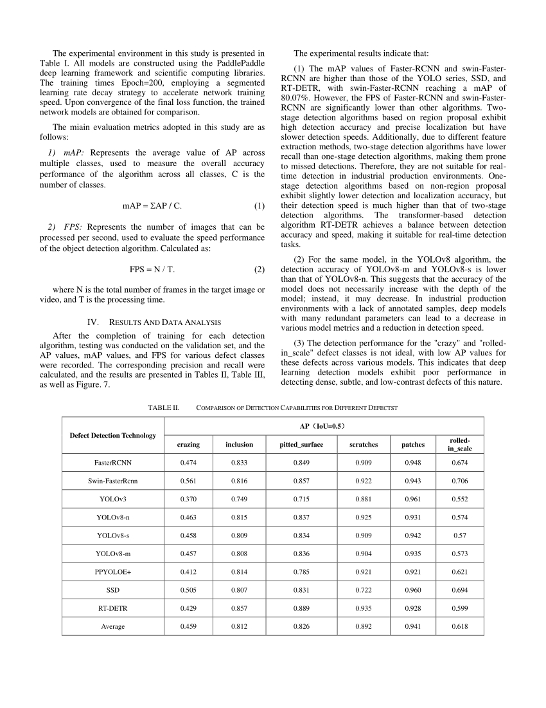
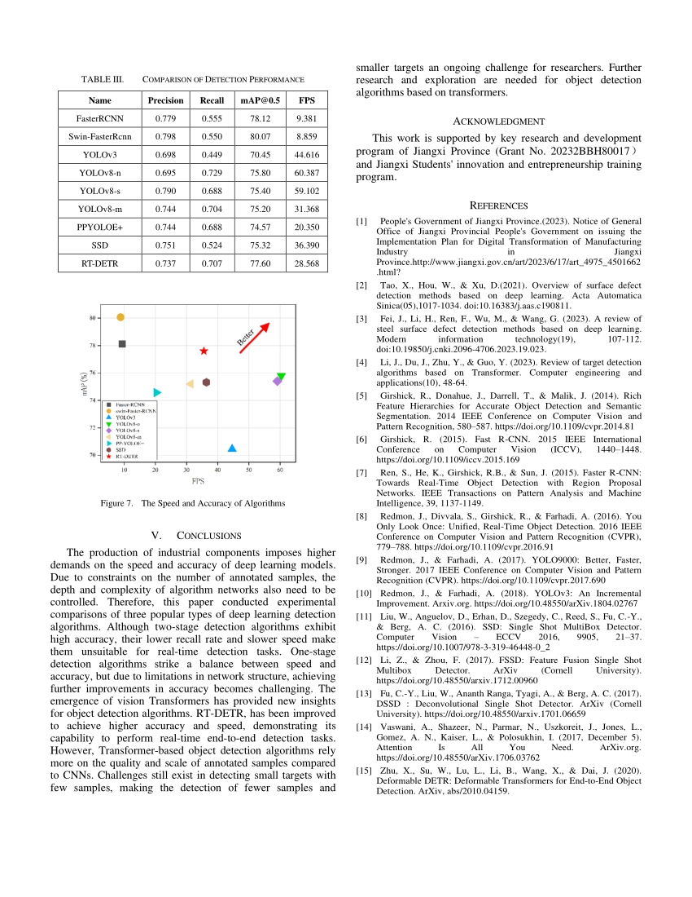

# Industrial Component Defect Detection Technology Based on Deep Learning

Abstract—In recent years, with the advancement of deep learning technology, the task of industrial component defect detection has shifted from manual inspection to deep learning model detection. However, striking a balance between the precision and speed required by industrial production has become a new challenge. This paper categorizes the current mainstream object detection algorithms into three types: one-stage detection algorithms, two-stage detection algorithms, and transformer-based detection algorithms. The structures and characteristics of each type of algorithm are elucidated. Comparative experimental studies are conducted to analyze the advantages and disadvantages of these algorithms. The paper summarizes optimization methods and effects for each type of algorithm and offers a forward-looking perspective on the prospective trends in the evolution of defect detection algorithms.

Keywords-object detection; deep learning; transformer; yolo; industrial component defect

https://doi.org/10.1145/3677182.3677297

